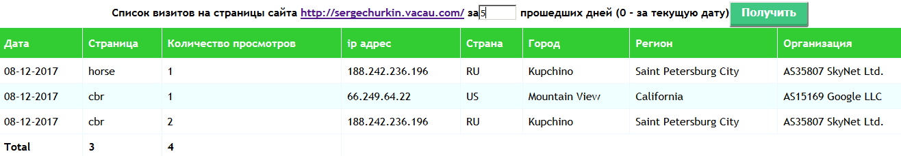

# log_pl_sql
Build the Log of visits WEB site pages based on AJAX requests (Oracle PL/SQL and js).

Просмотр журнала посещений страниц WEB-сайта на основе запросов AJAX (Oracle PL / SQL и js).



## Description

The application reads log information in `Oracle` table:

```
CREATE TABLE countlog (
  id number(10) NOT NULL,
  dt date DEFAULT NULL,
  ip varchar2(100) DEFAULT NULL,
  page varchar2(100) DEFAULT NULL,
  nview number(10) DEFAULT NULL,
  CONSTRAINT count_log_pk PRIMARY KEY (id)
);
CREATE INDEX countlog_idx ON countlog(dt);
```
Before running, you must [configure](https://alpitru.wordpress.com/2008/06/24/plsql-http-service/) the PL / SQL HTTP service.
The data is read by the procedure `COUNT_LOG.prc` that is called by url for example `http://localhost:8080/dd/CH.COUNT_LOG`.
In the text of the procedure there are links to the files `.js` and `.css`, which should be available to the WEB server.

